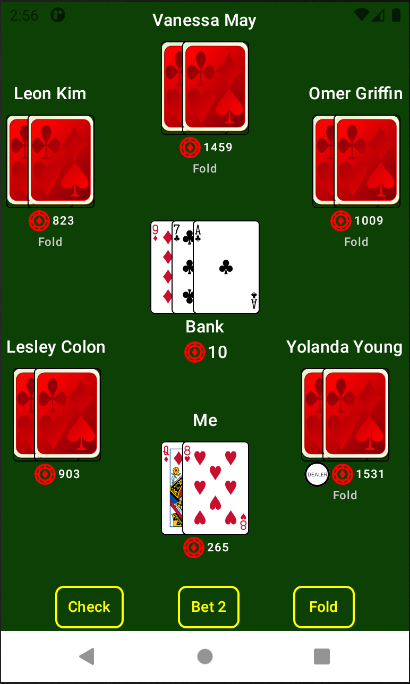
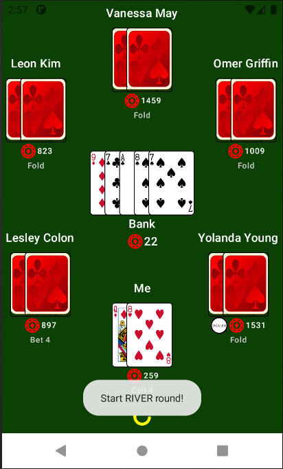
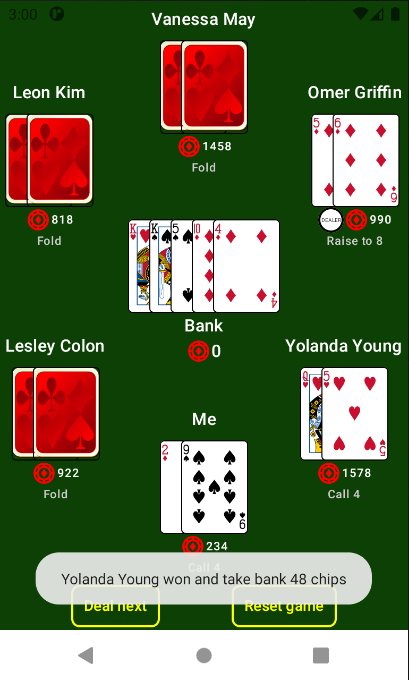

# CardGame
Texas Holdem Poker
Starting Bets: Small blind (1 chip) and Big blind (2 chips)

Limited 1-Bet/3-Raise
Bet/Raise Size
- For PreFlop and Flop Rounds: 2 chips
- For Turn and River Rounds: 4 chips

Note:
- Chips in the game are not associated with real money. This game is not gambling; it is for entertainment only.
- Closing the app during a game resets your previous progress. Chip balances are saved when the player sees the "DIAL NEXT" button.

Texas Holdem Poker built with Kotlin and Jetpack Compose.

## Screenshots

## Features
- Texas Holdem poker engine
- Betting rounds and chip management
- AI opponents
- Responsive Compose UI
- Playing card deck with SVG assets

## Architecture
- Kotlin
- MVVM
- Android ViewModel
- StateFlow
- Jetpack Compose
- Material 3
- Repository pattern

## Project Structure
Third-Party Assets

This project contains third-party playing card artwork distributed under their respective licenses.

See THIRD_PARTY_NOTICES.md for attribution and licensing information.

License

MIT License
